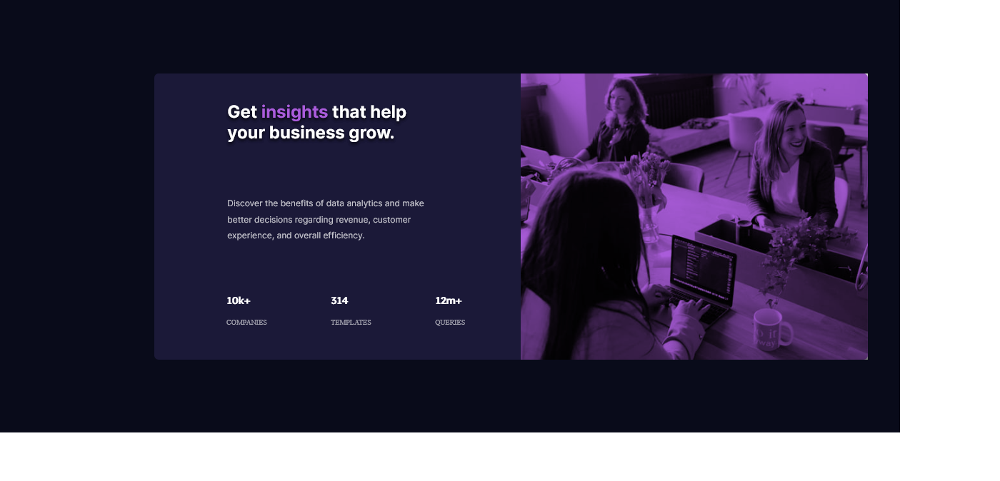

# Frontend Mentor - Stats preview card component solution

This is a solution to the [Stats preview card component challenge on Frontend Mentor](https://www.frontendmentor.io/challenges/stats-preview-card-component-8JqbgoU62). Frontend Mentor challenges help you improve your coding skills by building realistic projects.

## Table of contents

- [Overview](#overview)
  - [The challenge](#the-challenge)
  - [Screenshot](#screenshot)
  - [Links](#links)
- [My process](#my-process)
  - [Built with](#built-with)
  - [What I learned](#what-i-learned)
  - [Continued development](#continued-development)
  - [Useful resources](#useful-resources)
- [Author](#author)


**Note: Delete this note and update the table of contents based on what sections you keep.**

## Overview

### The challenge

Users should be able to:

- View the optimal layout depending on their device's screen size

### Screenshot





### Links

- Solution URL: [](https://github.com/VernonDodo/stats-preview-card-component)
- Live Site URL: [](https://stats-preview-card-component-3gd7975wx-vernondodo.vercel.app/)

## My process

I basically built the desktop version first. Used HTML for the basic layout and styled it with my own pre-styled CSS classes.

For mobile, I adapted the desktop design using media queries.

### Built with

- Semantic HTML5 markup
- CSS custom properties
- Flexbox

### What I learned

I am much more adept at CSS now. I have even learnt by just looking at a design, how to style my CSS classes and then just apply those classes to html element.

For example, to center an element within the body:

```css
.center {
  position: absolute;
  left: 50%;
  top: 50%;
  transform: translate(-50%, -50%);
}
```
```html
<div class="container center">
.
.
.
</div>
```

### Continued development

I will continue to work on styling with native css. Only once I have a firm grasp of styling with native CSS, will I move on to pre-styled CSS - need an understanding of native CSS first.


### Useful resources

- [CSS Tricks](https://css-tricks.com/)
This is a very useful resource to learn the intracacies of CSS, the ones that basic manuals does not cover.

- [W3 Schools](https://www.w3schools.com/) - This is an amazing resource for all web-development related work, pertaining to the most basic and popular languages used in web development.

- [MDN Web Docs](https://developer.mozilla.org/en-US/docs/Web/Guide)
This is a resource guide geared towards development for Firefox, but a lot of the concepts are applicable to mist browsers.


## Author


- Frontend Mentor - [@VernonDodo](https://www.frontendmentor.io/profile/VernonDodo)
- Twitter - [@likeavernon](https://www.twitter.com/yourusername)
